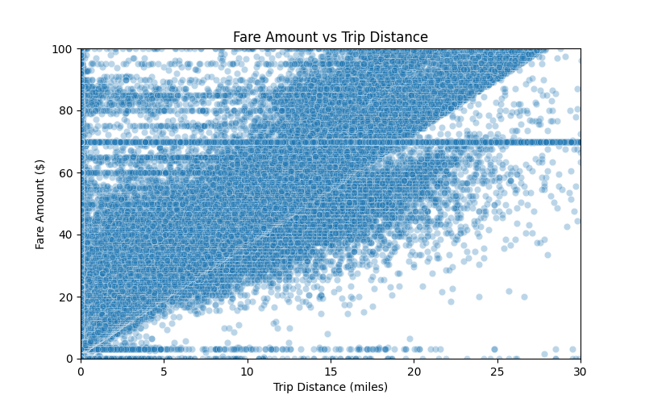
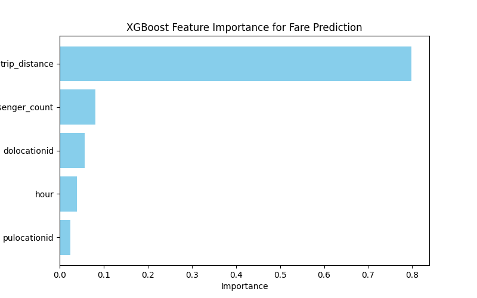

# NYC Taxi Trip Analysis 🚖

## Project Overview
This project analyzes NYC taxi trips to extract insights, build predictive models, and detect anomalies. Key components include:

- Loading and preprocessing trip data from parquet files to PostgreSQL
- Visualizing trip patterns and distributions
- Predicting taxi fares and trip durations using XGBoost
- Detecting anomalies in fares and trips
- Similarity search using pgvector embeddings to find comparable trips

---

## Project Structure
NYC-Taxi-Analysis/
│
├── data/ # Parquet data files (ignored in GitHub)
├── src/ # Python scripts
│ ├── load_data.py # Load parquet to PostgreSQL
│ ├── db_utils.py # Database utilities + preprocessing
│ ├── visualization.py # Data visualization
│ ├── fare_model.py # Fare prediction model
│ ├── duration_model.py # Trip duration prediction
│ └── anomaly.py # Anomaly detection
├── results/ # Saved plots & model outputs
├── requirements.txt # Python dependencies
└── README.md # Project documentation

---
## Data Setup

The NYC Taxi dataset used in this project is **not included** in this repository due to its large size.  
To run the project, you need to download the dataset and place it in the `data/` folder.

### Download the Data
1. Go to the official NYC Taxi & Limousine Commission (TLC) Trip Data portal:  
   [NYC Taxi & Limousine Commission - Trip Data](https://www.nyc.gov/site/tlc/about/tlc-trip-record-data.page)
2. Download the desired **yellow taxi trip data** files in Parquet format (or CSV if preferred).  
3. Place the downloaded files inside the `data/` folder in the project root:

### Notes
- The `data/` folder is **ignored by Git** to keep the repository lightweight.  
- Ensure the files match the names expected in `src/load_data.py` or adjust the script accordingly.  
- After placing the data, you can run the scripts to load, preprocess, and visualize the data.

---

## 1️⃣ Data Preprocessing
- Converted pickup/dropoff timestamps to datetime
- Calculated trip duration (minutes)
- Extracted hour and day of week
- Identified rush hours (7–10 AM, 4–7 PM)

**Reusable preprocessing function:** `db_utils.py -> preprocess_data(df)`

---

## 2️⃣ Visualizations

### Trip Distance Distribution

### Trip Duration Distribution

### Fare VS Distance

### Trips Over Time (Hourly/Day)

### Daily Revenue Trend

### Average trip distance and duration over time

### Hourly Demand Heatmap

---

## 3️⃣ Fare Prediction Model (XGBoost)
- **RMSE:** 10.54  
  - On average, predicted fares differ from actual fares by ~$10.5.
- **R²:** 0.67  
  - The model explains 67% of the variance in fares.

**Insights:**  
- Trip distance is the most influential feature.  
- Pickup and drop-off locations capture zone-specific fare differences.  
- Time-of-day (rush hour) helps model fare variability.  

**Predicted VS Actual Fare**

**Importance Features for Fare Prediction**

---

## 4️⃣ Trip Duration Prediction Model (XGBoost)
- **RMSE:** 34.35 minutes  
  - Average error in predicting trip duration.
- **R²:** 0.08  
  - Only 8% of duration variance is explained by the model.

**Insights:**  
- Trip distance contributes to duration but isn’t sufficient for accurate prediction.  
- Rush hour and pickup time have limited effect due to unpredictable traffic.  

---

## 5️⃣ Anomaly Detection (Isolation Forest)
- **Number of detected anomalies:** 28,245  

**Purpose:**  
- Identify unusual trips, like very high fares for short distances, which may indicate data errors or fraud.  

**Method:**  
- Isolation Forest isolates outliers faster than normal points using features like trip distance, fare, duration, pickup/drop-off zones, and rush hour.  

**Insights:**  
- Many anomalies are extremely high fares for short trips.  
- Some anomalies may be legitimate but rare trips (special services, unusual routes).  

**Visualize Anomaly**

---

## Setup

# Clone repo
git clone https://github.com/your-username/NYC-Taxi-Analysis.git
cd NYC-Taxi-Analysis

# Install dependencies
pip install -r requirements.txt

## Run Scripts

# Load data into PostgreSQL
python src/load_data.py

# Generate visualizations
python src/visualization.py

# Fare Prediction
python src/fare_model.py

# Trip Duration Prediction
python src/duration_model.py

# Anomaly Detection
python src/anomaly.py

